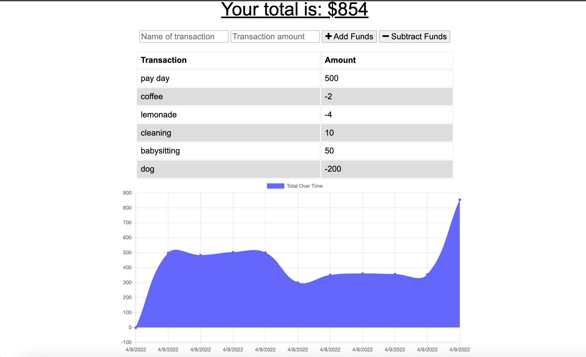

# Budget Tracker Starter Code

This Progressive Web Application allows users to track their money and access this information at any time, even when they are offline. 

This application uses NoSQL, Progressive Web Applications (PWA), Service Workers, Offline functionality, Manifest, and MongoDB Atlas.

## USER STORY
AS AN avid traveler
I WANT to be able to track my withdrawals and deposits with or without a data/internet connection
SO THAT my account balance is accurate when I am traveling 

## ACCEPTANCE CRITERIA 
GIVEN a budget tracker without an internet connection
WHEN the user inputs an expense or deposit
THEN they will receive a notification that they have added an expense or deposit
WHEN the user reestablishes an internet connection
THEN the deposits or expenses added while they were offline are added to their transaction history and their totals are updated

# Resources
Deployed Application: https://limitless-headland-64911.herokuapp.com/

Github Repo: https://github.com/kspitalnic/pwa-budget-bassoon
 

Screenshot: 

